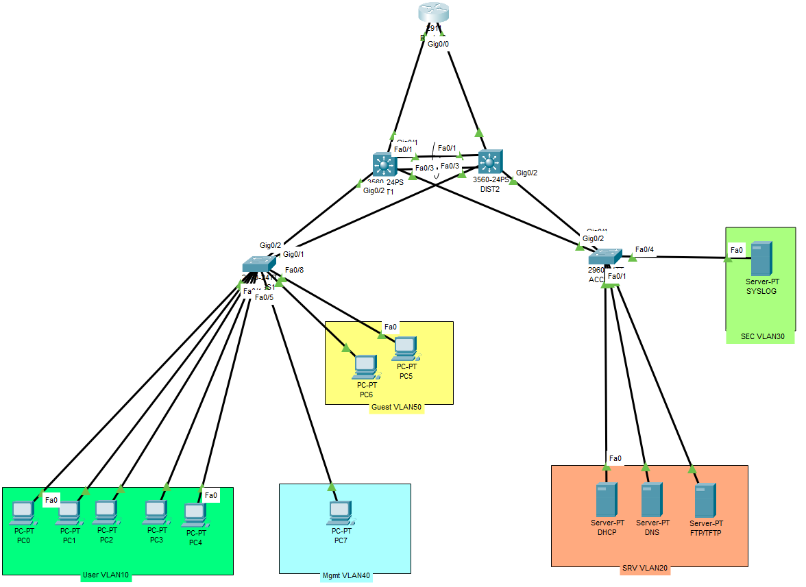

# Enterprise-Network-Security-Lab

## Overview

This project is a hands-on enterprise network and security lab designed to demonstrate practical networking, security, troubleshooting, and infrastructure skills. 

## Objectives

- Design an enterprise network topology
- Implement VLAN segmentation
- Configure routing
- Implement network security controls
- Configure secure device management
- Test connectivity and troubleshoot network problems
- Document the configuration and troubleshooting process

## Network Topology

## Planned Network Segmentation

| VLAN | Purpose | Network |
|---|---|---|
| 10 | Users | 192.168.10.0 /24 |
| 20 | Servers | 192.168.20.0 /24 |
| 30 | Security / Monitoring | 192.168.30.0 /24 |
| 40 | Management | 192.168.40.0 /24 |
| 50 | Guest | 192.168.50.0 /24 |

## Technologies

- Cisco networking
- VLANs
- Inter-VLAN Routing
- HSRP
- OSPF
- EtherChannel / LACP
- ACL - Extended ACLs
- DHCP
- DNS
- Port Security

## Security Goals

The lab will implement security controls including:

- Network segmentation
- Access control list
- Management VLAN
- Port security
- DHCP snooping
- Dynamic ARP inspection
- ACL-based traffic filtering
- Logging and monitoring
- Least-privilege access

## Troubleshooting

The project will include intentionally created network problems and documented troubleshooting procedures. 

Examples:

- VLAN connectivity problems
- Routing issues
- ACL misconfiguration
- DHCP failure
- DNS problems
- Incorrect trunk configuration

## Project status

Completed.
The lab was configured, secured, tested, and documented.

Validation included:

- VLAN segmentation
- Inter-VLAN routing
- HSRP gateway redundancy
- OSPF routing
- EtherChannel/LACP link redundancy
- ACL-based traffic filtering
- Port Security
- DHCP Snooping
- Dynamic ARP Inspection
- Centralized Syslog
- DHCP/DNS/FTP/TFTP services
- EtherChannel failure testing
- OSPF failure testing
- HSRP failover testing
- Troubleshooting and recovery validation

## Skills Demonstrated

- Network design
- Network configuration
- Network troubleshooting
- Security fundamentals
- Infrastructure hardening
- Documentation
- Git and GitHub

